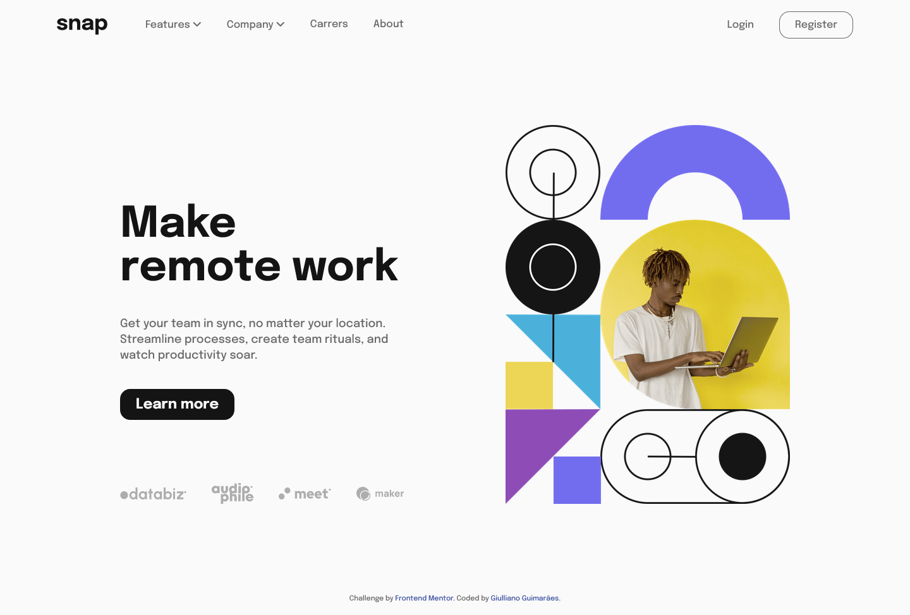
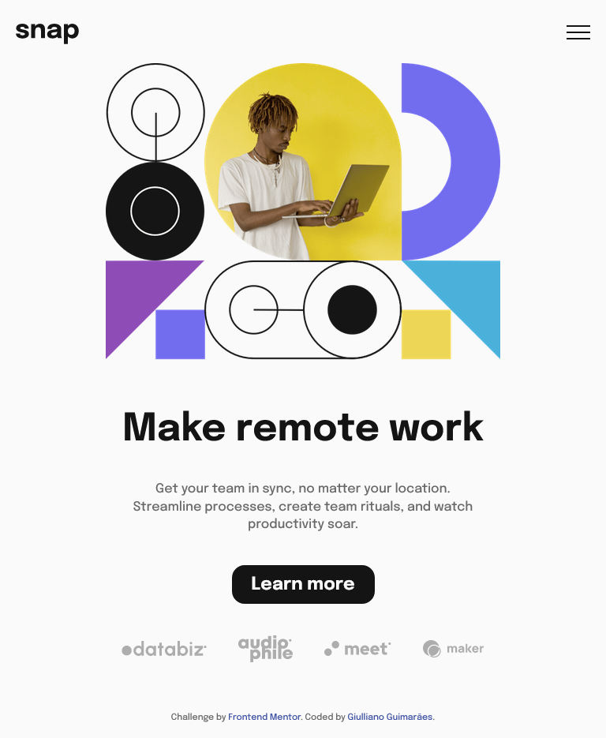
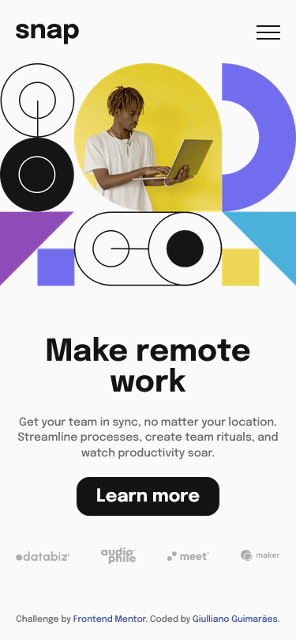

# Intro section with dropdown navigation

Este é um desafio do [Frontend Mentor](https://www.frontendmentor.io) que consiste em uma landing page responsiva com animações de navegação entre uma página e outra, além de menus no estilo dropdown.

## Layout

*Captura de tela em 1440px - Desktop*

---

*Captura de tela em 768px - Tablet*

---

*Captura de tela em 375px - Mobile*

Você pode conferir o deploy no seguinte link: [https://intro-section-with-dropdown-swart.vercel.app](https://intro-section-with-dropdown-swart.vercel.app)

## Ferramentas e Tecnologias

O projeto foi montado utilizando o Visual Studio Code, com as seguintes tecnologias:

- HTML5
- CSS3
- JavaScript
- Sass

## Instalação

Caso queira baixar e instalar os arquivos no seu computador e visualizar o projeto:

- Abra o projeto com Visual Studio Code.
- Instale as extensões Live Server e Live Sass Compiler.